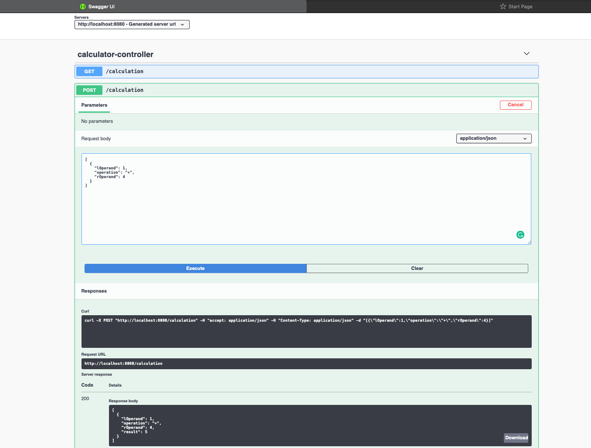

# Maven Build
mvn clean install

# Docker-build
docker build --build-arg JAR_FILE='target/*.jar' -t lhft/test .

# Code Coverage
target/site/jacoco/index.html

# Run 
- Direct : java -jar target/*.jar
- Maven  : mvn spring-boot:run
- Docker : docker run -p 8080:8080 lhft/test

# API - Documentation
This link has API documentation as well as web client to test API.

localhost:8080/swagger-ui/index.html?configUrl=/v3/api-docs/swagger-config

